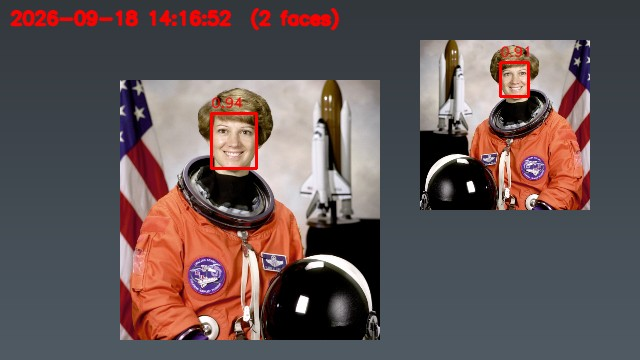
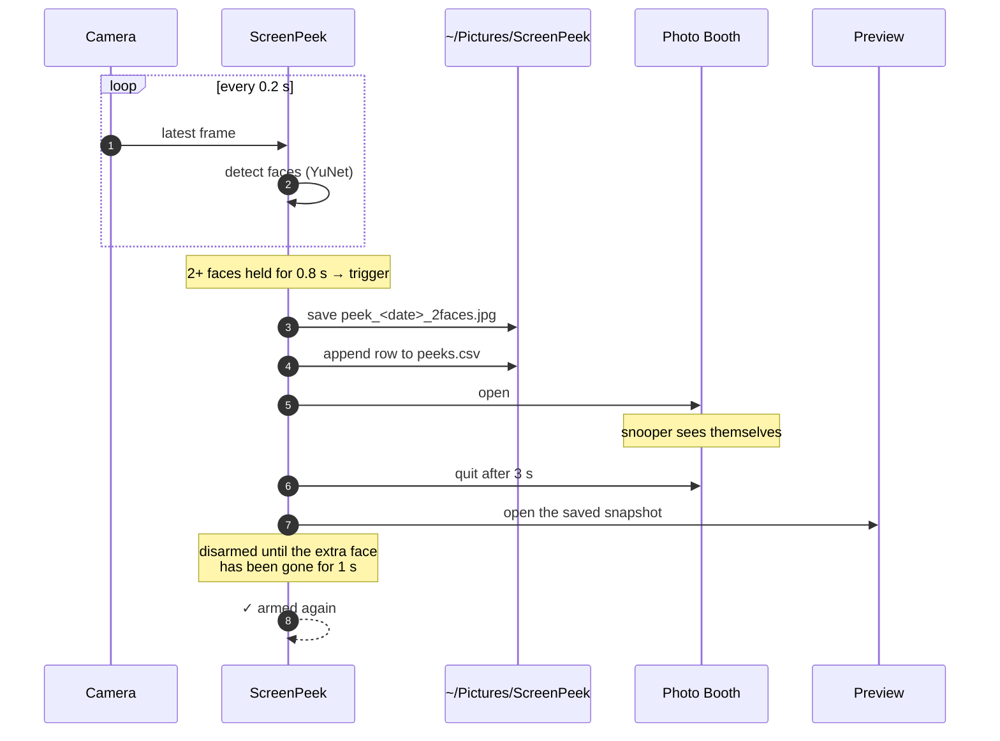
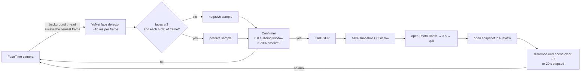

<div align="center">

# 👀 ScreenPeek

**Somebody reading over your shoulder? Show them their own face.**

ScreenPeek watches your MacBook's camera. The moment it sees a second face — you *plus* someone
leaning in behind you — it snaps a photo of the moment, pops open Photo Booth so the snooper is
suddenly staring at a live feed of themselves, then quietly closes it and shows you who it was.

[](#requirements)
[](#requirements)
[](#how-it-works)
[](#how-it-works)
[](#running-the-tests)
[](LICENSE)



<sub>What a saved snapshot looks like: every face gets a red box and a confidence score.
(Sample built from a public-domain NASA portrait.)</sub>

</div>

---

## Contents

- [What happens on a peek](#what-happens-on-a-peek)
- [Requirements](#requirements)
- [Install](#install)
- [Test it first](#test-it-first)
- [Run](#run)
- [Where things are saved](#where-things-are-saved)
- [How it works](#how-it-works)
- [Tuning](#tuning)
- [Troubleshooting](#troubleshooting)
- [Running the tests](#running-the-tests)
- [Privacy and etiquette](#privacy-and-etiquette)
- [Uninstall](#uninstall)

---

## What happens on a peek



In words:

1. A JPEG of the moment is saved, faces boxed, timestamped.
2. The event is logged to a CSV — a running history of every peek.
3. **Photo Booth opens.** The peeker sees their own face on your screen.
4. **Three seconds later it closes**, and the snapshot opens in Preview so *you* see who it was.
5. ScreenPeek waits for the extra face to leave, then re-arms. The next person gets their own portrait.

## Requirements

- macOS (uses the built-in FaceTime camera, `open`, and Photo Booth)
- Python 3.9 or newer — `python3 --version` to check; macOS ships one
- Nothing else. The install script builds an isolated environment with OpenCV;
  the face-detection models are included in this repo.

## Install

```bash
git clone https://github.com/<you>/screenpeek.git
cd screenpeek
chmod +x install.sh run.sh
./install.sh
```

`install.sh` creates a `.venv` folder inside the project and installs OpenCV into it.
Your system Python is untouched; deleting the folder removes everything.

## Test it first

```bash
./run.sh --check
```

This verifies the model, camera and output folder, then prints a live face count for 15 seconds
with confidence scores and timings. **Nothing is launched** — it's a dry run.

```
ScreenPeek self-check

  python      3.13.2
  opencv      4.14.0
  detector    yunet  (/Users/you/screenpeek/face_detection_yunet_2023mar.onnx)
  snapshots   /Users/you/Pictures/ScreenPeek (writable)

  opening camera 0...
  got a 640x360 frame

  Counting faces for 15 seconds.
  Sit in front of the camera, then have someone lean in next to you.

    1 face(s)  #  0.96
    1 face(s)  #  0.95
    2 face(s)  ##  0.95 0.88     ← someone leaned in
    2 face(s)  ##  0.96 0.91

  camera         30 fps
  detection      9.8 ms per frame (yunet)
  most faces     2 at once
  test snapshot  /Users/you/Pictures/ScreenPeek/peek_2026-09-18_14-08-43_2faces.jpg

  Working. It will trigger at 2+ faces held for 0.8s.
```

> **First run:** macOS asks whether Terminal may use the camera. Click **OK**.
> If no prompt appears and the camera fails to open, see [Troubleshooting](#troubleshooting).

## Run

```bash
./run.sh
```

Leave that Terminal window open (minimised is fine). The green camera light stays on while it runs.

**Stop:** press <kbd>Ctrl</kbd>+<kbd>C</kbd> in that window.

Every line it prints is also appended to `screenpeek.log` in the project folder, so you have a record
even after the window is closed:

```
[14:10:46] 2 faces — someone's peeking. (trigger #7)
[14:10:46]   → saved peek_2026-09-18_14-10-46_2faces.jpg
[14:10:46]   → Photo Booth is up. Say cheese.
[14:10:50]   → Photo Booth closed after 3s.
[14:10:50]   → opened the snapshot.
[14:10:52]   … watching for the extra face to leave (re-arms after 1s clear, or 20s)
[14:10:54]   ✓ armed again (extra face left)
```

## Where things are saved

| What | Where |
|---|---|
| Snapshots | `~/Pictures/ScreenPeek/peek_YYYY-MM-DD_HH-MM-SS_<n>faces.jpg` |
| Event log (CSV) | `~/Pictures/ScreenPeek/peeks.csv` — `timestamp, faces, snapshot` |
| Console log | `screenpeek.log` next to the script |

Change the snapshot folder with `--dir`:

```bash
./run.sh --dir ~/Documents/peeks
```

Open the folder from Terminal with `open ~/Pictures/ScreenPeek`.

## How it works



**Detection.** [YuNet](https://github.com/opencv/opencv_zoo/tree/main/models/face_detection_yunet)
is a compact convolutional face detector that ships with OpenCV ≥ 4.5.4. The model is 230 KB and runs
in about 10 ms per 640-px frame on a MacBook CPU. Unlike the classic Haar cascade, it handles turned
heads, glasses and poor light — which is exactly the "leaning in from the side" case. Haar is kept as
an automatic fallback for old OpenCV builds (`--backend haar` forces it).

**Freshness.** Webcams buffer several frames internally. A thread reads the camera continuously and
keeps only the newest frame, so the detector never analyses a half-second-old image.

**Confirmation.** Each check adds a yes/no sample to a sliding 0.8-second window. A trigger requires
the window to be full *and* at least 70% of its samples positive. A one-frame flicker (1 of 5) is
ignored; a real person leaning in (5 of 5) fires in under a second. With a realistic per-frame false
positive rate of a few percent, simulated false alarms are effectively zero per hour.

**Size filter.** Faces shorter than 6% of the frame height are ignored — that covers a photo on the
wall, a phone screen, or someone across the room.

**Re-arming.** After a trigger ScreenPeek is *disarmed* until the extra face has been gone for one
second (or 20 s have passed, if the peeker never leaves). One peek = one portrait; the next peeker
gets their own.

**Camera hand-over.** Photo Booth needs the camera too. ScreenPeek releases it before launching Photo
Booth and reclaims it afterwards — retrying indefinitely if another app is holding it, rather than
giving up.

## Tuning

Every flag has a sensible default; you only need these if the defaults don't fit your desk.

| Flag | Default | Effect |
|---|---|---|
| `--min-faces N` | `2` | Trigger only when N or more faces are visible |
| `--confirm S` | `0.8` | Seconds the extra face must persist. Higher = fewer false alarms, slower |
| `--confirm-ratio R` | `0.7` | Fraction of checks in that window that must be positive |
| `--rearm S` | `1` | Seconds the scene must be clear before re-arming |
| `--cooldown S` | `20` | Re-arm after this long even if the peeker never leaves |
| `--min-score X` | `0.75` | Detector confidence needed to count a face (0.5–0.95). Lower catches more side angles and dim rooms, and false-alarms more |
| `--min-face F` | `0.06` | Ignore faces shorter than this fraction of frame height |
| `--width PX` | `640` | Capture width. `1280` sees people further away at ~4× the CPU |
| `--interval S` | `0.2` | Seconds between checks |
| `--show-for S` | `3` | How long Photo Booth stays open. `0` = leave it open |
| `--handover S` | `1.5` | Grace period for Photo Booth to release the camera |
| `--no-open-snapshot` | off | Don't open the saved photo in Preview |
| `--no-photo-booth` | off | Silent mode: snapshot and log only |
| `--sound` | off | Also play a system sound |
| `--clean` | off | Save snapshots without boxes and timestamp |
| `--dir PATH` | `~/Pictures/ScreenPeek` | Where snapshots and the CSV go |
| `--preview` | off | Live window with boxes, scores, confirm %, FPS. <kbd>q</kbd> closes |
| `--check` | off | Self-test mode (see above) |
| `--backend auto\|yunet\|haar` | `auto` | Force a detector |

`./run.sh --help` lists them all.

**Recipes**

```bash
# Silent evidence collector: no Photo Booth, no Preview, faster confirm
./run.sh --no-photo-booth --no-open-snapshot --confirm 0.5

# Open-plan office: only react to someone very close, and be sure about it
./run.sh --min-face 0.12 --confirm 1.5

# Dim room / people at an angle
./run.sh --min-score 0.6

# Big room, people further back
./run.sh --width 1280
```

## Troubleshooting

**"Could not open camera 0."**
macOS hasn't granted Terminal camera access. System Settings → Privacy & Security → Camera → switch
**Terminal** on. Then quit Terminal completely (<kbd>Cmd</kbd>+<kbd>Q</kbd>) and reopen it — the new
permission is only picked up on a fresh launch. Also close anything else using the camera (Zoom,
FaceTime, Photo Booth).

**Photo Booth opens to a black frame.**
It didn't get the camera in time. Raise the grace period: `--handover 3`.

**A one-time "Terminal wants to control Photo Booth" dialog.**
That's the polite way of quitting Photo Booth (AppleScript). Either answer is fine — if you decline,
ScreenPeek falls back to force-quitting it, which needs no permission.

**It fires when nobody is there.**
Open the snapshot it saved — the red boxes show what it counted as a face. A poster, a photo frame, or
a face on a second monitor are the usual suspects. Raise `--min-face` or `--min-score`, or move the
offending object.

**It misses someone standing behind me.**
Their face is small in the frame. Try `--min-score 0.6` first; if that's not enough, `--width 1280`.

**It seemed to stop after the first trigger.**
Check `screenpeek.log`. Most likely it's disarmed because the second face is still in view — it says
`… watching for the extra face to leave`. It re-arms one second after the scene clears (or after 20 s
regardless) and prints `✓ armed again`.

**"OpenCV could not parse …" / detector fails to load.**
The model files should sit next to `screenpeek.py`. Re-run `./install.sh`, which re-downloads the YuNet
model from the OpenCV model zoo if it's missing and verifies its checksum.

## Running the tests

The suite needs no camera and no macOS: the camera and the system commands are replaced with fakes,
and detection is tested against a real photograph.

```bash
./.venv/bin/python tests/test_screenpeek.py
# or
./.venv/bin/python -m pip install pytest && ./.venv/bin/python -m pytest tests/
```

Covers detector selection and fallback, YuNet accuracy on a tilted head, the size filter, the
confirmation window under jittered timing, the camera thread, the full trigger sequence, re-arming
(peeker leaves / peeker stays), silent mode, camera-busy recovery, and snapshot naming.

## Privacy and etiquette

- **Everything stays on your Mac.** No network access, no telemetry. Images are written only to the
  folder you choose.
- **The camera light is on** the whole time ScreenPeek runs. That's macOS being honest, and it's worth
  remembering before carrying the laptop into a meeting.
- **Other people are being photographed.** In a shared space the person behind you didn't agree to a
  portrait. Consider `--no-photo-booth --no-open-snapshot` for a quieter log, and check local rules
  about recording in the workplace.

## Uninstall

Delete the project folder (the `.venv` inside it is the only thing that was installed). Optionally
delete `~/Pictures/ScreenPeek/` and remove Terminal from System Settings → Privacy & Security → Camera.

---

<sub>Face detection: YuNet (MIT) and the OpenCV Haar cascade (Apache 2.0). See
[THIRD_PARTY_NOTICES.md](THIRD_PARTY_NOTICES.md).</sub>
